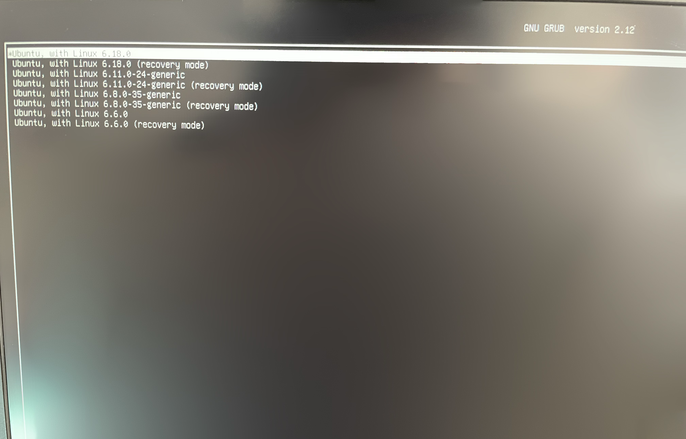

**How to compile Linux Kernel 6.18**

Linux Kernel 6.18, the latest stable version of the Linux kernel, has been released on Sunday, November 30, 2025. I’m compiling it on my Ubuntu machine to try it. Here is how you can compile and install it step by step.

Prerequisites: First, install the necessary build tools: 


```sudo apt update && sudo apt install build-essential libncurses-dev bison flex libssl-dev libelf-dev```

1. Download the kernel from https://kernel.org
2. Move it to /usr/src using 

```sudo mv linux-6.18.tar.xz /usr/src```

3. Enter the directory usr/src via 

```cd /usr/src```

 and extract it using 
 
 ```sudo tar -xf linux-6.18.tar.xz```

4. Enter directory that contains the kernel source code via 

```cd linux-6.18```

5. You may need elevated permissions for the next steps so run 

```sudo su``` 

command to prevent further errors.

6. Copy your current kernel configuration to ensure your hardware settings are preserved: 

```cp /boot/config-$(uname -r) .config```

To use your current linux kernel’s configurations, use this command 

```make olddefconfig```

7. Run these commands to prevent certification errors on Ubuntu/Debian:

        ```scripts/config --disable CONFIG_SYSTEM_TRUSTED_KEYS```
         ```scripts/config --disable CONFIG_SYSTEM_REVOCATION_KEYS```

8. Check your CPU cores 

```nproc```

9. Compile the kernel (replace 4 with your CPU core count) using


```make -j4``` 

It will take 1-2 hours depending on your hardware.


10. Once compilation finishes, install the modules and the kernel image: 

```make modules_install && make install```

Reboot your system. When the computer starts up, you should see the Linux 6.18.0 option in the GRUB menu.



