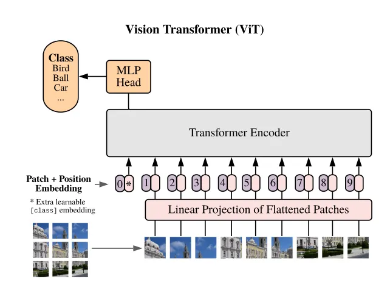
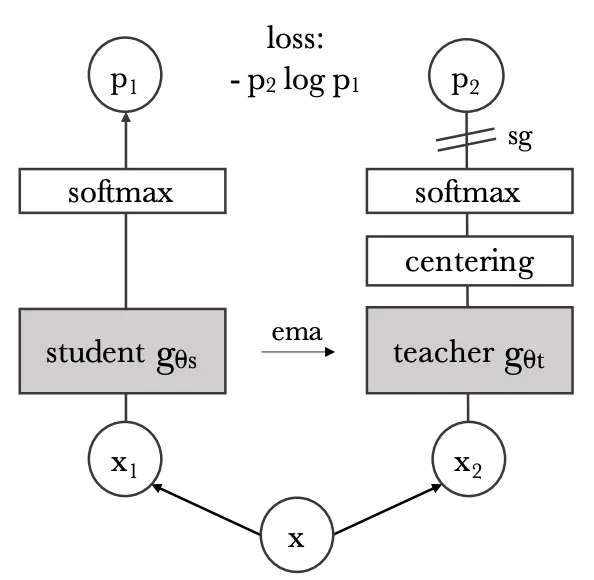
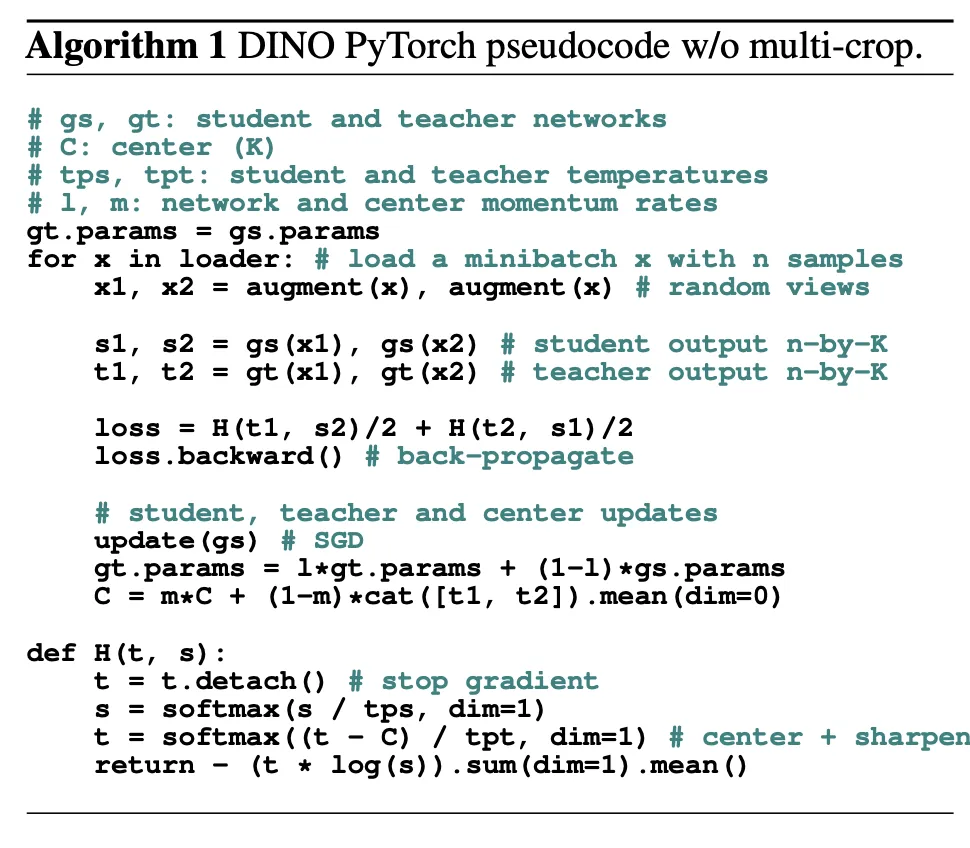
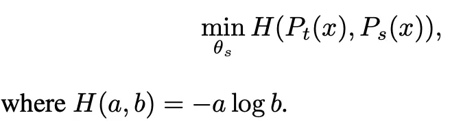
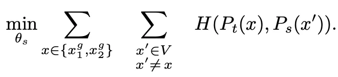
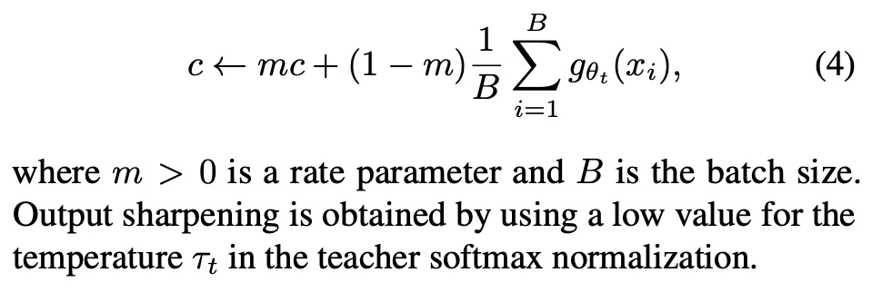
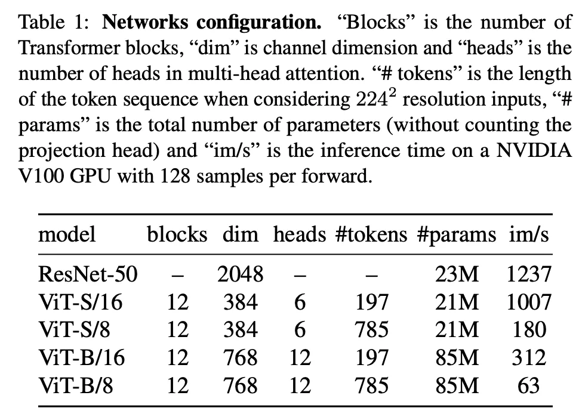
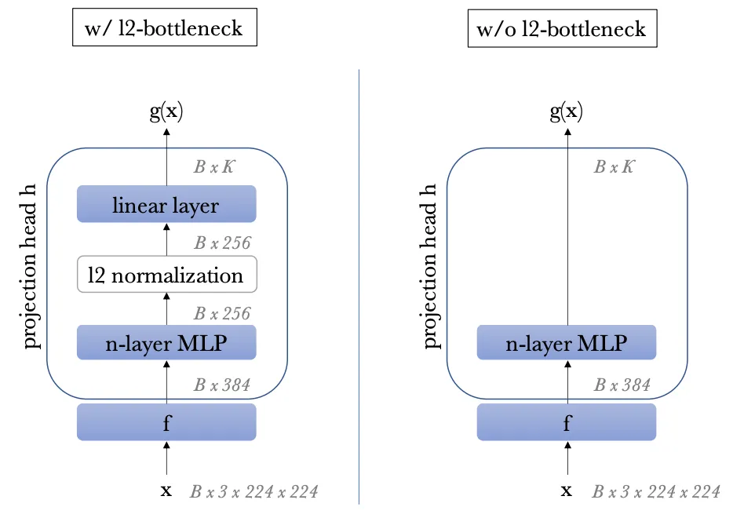

In this blog post, we’ll explore DINO in more detail, look at how it works, and discuss why it’s a big deal. So, let’s get started!

The paper “Emerging Properties in Self-Supervised Vision Transformers” introduces DINO (Self-DIstillation with NO Labels), a novel approach to self-supervised learning. The authors of the paper are Mathilde Caron, Hugo Touvron, Ishan Misra, Hervé Jégou, Julien Mairal, Piotr Bojanowski, and Armand Joulin. Here are the key points from the paper:

Vision Transformers (ViTs): The paper focuses on Vision Transformers (ViTs), which are a type of model that has been successful in image classification tasks.

Self-Supervised Learning: The authors propose a new self-supervised learning method called DINO. In this method, a student model learns by aligning its outputs with a dynamically updated teacher model.

Emerging Properties: The authors found that self-supervised ViTs contain explicit information about the semantic segmentation of an image, which does not emerge as clearly with supervised ViTs, nor with convolutional networks.

k-NN Classifiers: The features learned by the self-supervised ViTs are also excellent k-NN classifiers, reaching 78.3% top-1 on ImageNet with a small ViT.

Importance of Certain Techniques: The study underlines the importance of momentum encoder, multi-crop training, and the use of small patches with ViTs.

# Vision Transformers

Vision Transformers (ViTs) are a type of model that has been successful in image classification and other computer vision tasks. They were introduced by Dosovitskiy et al. in 2020. The key advantage of ViTs over traditional CNNs is their ability to model long-range dependencies between pixels in an image. This makes them particularly effective for tasks that require understanding the context and structure of the entire image.

Here’s a simple explanation of how Vision Transformers work:

Image to Patches: ViTs start by dividing an image into fixed-size patches. This is a departure from traditional Convolutional Neural Networks (CNNs) that usually process images pixel by pixel or in small receptive fields. Each of these patches is then flattened and linearly embedded into a vector.

Position Embeddings: Since the order of patches carries important spatial information, position embeddings are added to the patch embeddings. These embeddings are learned during the training process and help the model to understand the relative positions of different patches.

Transformer Encoder: The sequence of patch embeddings (with position embeddings) is then fed into a Transformer encoder. The Transformer encoder uses self-attention mechanisms to understand the dependencies between different patches. It can give more importance to certain patches when processing a particular patch.

Classification Token: To perform image classification, an extra learnable classification token is added to the sequence. This token is updated through the Transformer encoder and in the end, it is used to predict the class of the image.

Training: ViTs are usually trained using a large amount of labeled data. However, recent research has shown that they can also be effectively trained using self-supervised learning methods.

Performance: ViTs have achieved state-of-the-art performance on several image classification benchmarks. They have been found to perform comparably or even better than CNNs on many tasks.

# Self-Supervised Learning
In the context of the DINO paper, Self-Supervised Learning (SSL) is used to train Vision Transformers (ViTs) without the need for labeled data. This approach allows the model to learn meaningful representations from the data itself, without the need for explicit labels. This is particularly useful in scenarios where labeled data is scarce or expensive to obtain.

DINO Framework: DINO stands for Self-DIstillation with NO Labels. It’s a novel SSL method introduced in the paper “Emerging Properties in Self-Supervised Vision Transformers”. The DINO framework involves a student model learning by aligning its outputs with a dynamically updated teacher model.

Training Process: The training process involves passing two different random transformations of an input image to the student and teacher networks. Both networks have the same architecture but different parameters.

Teacher Network: The output of the teacher network is centered with a mean computed over the batch. A stop-gradient operator is applied to the teacher to propagate gradients only through the student. The teacher parameters are updated with the student parameters’ exponential moving average.

Student Network: The student network directly predicts the output of the teacher network using a standard cross-entropy loss.

Emerging Properties: The authors found that self-supervised ViTs contain explicit information about the semantic segmentation of an image, which does not emerge as clearly with supervised ViTs, nor with convolutional networks.

# Knowledge Distillation
Knowledge Distillation is a technique in machine learning where the aim is to transfer the knowledge from a larger, more complex model (often referred to as the teacher model) to a smaller, simpler model (known as the student model).

The teacher model is typically a large, complex model that has been trained on a task and achieved high performance. The student model is a smaller, simpler model that we want to train. The goal of knowledge distillation is to transfer the knowledge from the teacher model to the student model. This is done by training the student model to mimic the output of the teacher model. Instead of training the student model on the hard labels (the ground truth), it is trained on the soft targets, which are the output probabilities of the teacher model. These soft targets contain more information than the hard labels, as they show how the teacher model generalizes the data.

This figure encapsulates the distillation process where a student model learns to predict the same as a slowly evolving teacher model, which itself is an average of previous student models. This method allows for the student model to benefit from the stability and knowledge of the teacher model without directly copying its parameters. It’s a strategy designed to enable the student to generalize better and learn more robust features.

Input Image x: The process starts with an input image x, which is passed through some transformation to create two augmented views, x1​ and x2​. These augmented views are different but related images, generated by applying random transformations (like cropping, resizing, color jittering, etc.) to the original image x.

Student gθs: The first view, x1​, is fed into the student network. The student network, parameterized by θs​, processes the image and outputs logits, which are then converted into a probability distribution P1 over classes using a softmax function.

Teacher gθt ​​: The second view, x2​, is fed into the teacher network. The teacher network, parameterized by θt ​, also outputs logits, which are first centered (subtracting the mean of the logits over the batch to stabilize training) and then converted into a probability distribution P2 using a softmax function.

Loss Function: The diagram shows a loss function that is computed as the negative log likelihood of the probability P1 given by the student network, weighted by the probability P2 given by the teacher network. Mathematically, this is represented as −P2logP1, which is a form of cross-entropy loss that measures how well the student network’s predictions match the teacher network’s predictions.

Stop Gradient (sg): The symbol sg beside P2 indicates that the gradient is not backpropagated through the teacher network during the update of the student network. This means that when the student network is trained, the teacher network’s parameters are held fixed, and only the student’s parameters are updated.

EMA (Exponential Moving Average): The diagram also indicates that the teacher network’s parameters θt are updated using an EMA of the student’s parameters θs​. This means the teacher network’s parameters are not learned through backpropagation but are instead a moving average of the student network’s parameters. This creates a form of consistency regularization, as the teacher slowly accumulates the student’s knowledge over time.

The authors achieve self-training and knowledge distillation through a dynamic teacher-student framework. Here’s how they implement these concepts:

1. Self-Training:
— Dynamic Teacher-Student Framework: The model architecture includes both a teacher network and a student network, which have the same architecture but different parameters.
— Propagation of Knowledge: The teacher network provides target features of higher quality to guide the training of the student network. Gradients are propagated only through the student network using a stop-gradient operator on the teacher.
— Parameter Update: The teacher parameters are updated using an exponential moving average (EMA) of the student parameters. This dynamic updating process helps in improving the quality of features during training.

2. Knowledge Distillation:
— Soft Label Propagation: The teacher network, which is dynamically built during training, acts as a source of soft labels for the student network. This process is akin to knowledge distillation, where the student network learns to mimic the output of the teacher network.
— Model Compression and Performance Gains: By distilling knowledge from the teacher network to the student network, the model can achieve compression and performance gains. This approach integrates knowledge distillation directly into the self-supervised learning objective, rather than treating it as a separate post-processing step.

By combining self-training principles with knowledge distillation techniques within the DINO framework, the authors leverage the dynamic interaction between the teacher and student networks to enhance the learning process and improve the quality of features extracted by the model.

The exponential function is a part of the softmax function. It ensures that all output probabilities are positive and that larger logits result in larger probabilities.

# Initialization:

gs, gt: These variables represent the student and teacher networks, respectively.
C: This variable is used for centering the teacher’s outputs (logits).
tps, tpt: These are the temperatures for the softmax function applied to the student and teacher networks, respectively.
l, m: These represent the learning rate for the network parameters and the momentum rate for updating the center C.
Parameter Copying: Initially, the teacher network’s parameters (gt.params) are set to be the same as the student network’s parameters (gs.params).

Training Loop: For each minibatch x in the dataset loader:

x1, x2: Two different augmented views of the minibatch are created.
s1, s2: The student network processes both augmented views and produces outputs s1 and s2.
t1, t2: The teacher network also processes both augmented views, generating outputs t1 and t2. Since the teacher network provides targets for the student network, gradients are not propagated through it (detach() is called on t in the definition of H).
Loss Calculation:

The loss function H is applied to pairs (t1, s2) and (t2, s1). This cross-collateral loss function encourages the student network to produce similar outputs to the teacher network for different augmented views of the same image.
The computed loss is then averaged and backpropagation is performed (loss.backward()).
Updates:

The student network’s parameters are updated using stochastic gradient descent (SGD).
The teacher network’s parameters are updated as an exponential moving average (EMA) of the student’s parameters. This is a typical strategy in self-supervised learning where the teacher gradually evolves based on the student’s learning.
The center C is updated as a momentum-based moving average of the concatenated teacher outputs t1 and t2.
Loss Function Definition (H(t, s)):

t: Teacher’s output, detached from the computational graph to stop gradients.
s: Student’s output, which is normalized by the student’s temperature tps and passed through the softmax function.
t: Teacher’s output is normalized by the teacher’s temperature tpt and centered using the center C, then passed through the softmax function.
The function returns the negative cross-entropy between the teacher’s and student’s distributions, which is averaged over the batch.

This equation represents an optimization problem using the cross-entropy loss function, which is a common loss function in the fields of machine learning and deep learning for classification tasks.

# Objective Function:

minθs ​​H(Pt​(x),Ps​(x)): This expression states that the goal is to minimize the cross-entropy loss H between two probability distributions, Pt​(x) Ps​(x), with respect to the parameters θs ​ of the student network Pt​(x) represents the probability distribution output by the teacher network for input x, and Ps​(x) represents the probability distribution output by the student network for the same input.
Cross-Entropy Loss Function:

H(a,b)=−alogb: This defines the cross-entropy loss function H between two probability distributions a and b. For discrete probability distributions, the cross-entropy is the negative sum of the products of the elements of a (true distribution) and the logarithm of the elements of b (predicted distribution). In the context of machine learning, a would be the true label distribution (often a one-hot encoded vector), and b would be the predicted label distribution.
Minimization:

θs ​: These are the parameters of the student network that are being optimized. The minimization is performed by adjusting θs to reduce the difference between the student’s predictions and the teacher’s predictions.
Knowledge Distillation:

In the context of knowledge distillation, Pt​(x) is typically produced by a pre-trained teacher model that is considered to have high-quality predictions, possibly because it is a larger model or has been trained on a more comprehensive dataset.
Ps​(x), on the other hand, is produced by a student model that is being trained to emulate the teacher. The idea is that the student can learn to perform well by mimicking the teacher’s output distribution, without needing to replicate the teacher’s potentially more complex architecture.

# Training Process:

During training, the parameters θs​ are iteratively updated to minimize the cross-entropy loss. This is usually done using optimization algorithms like gradient descent.

minθs​​: The goal is to minimize the objective function with respect to the parameters θs​ of the student network.
∑x∈{x1g​,x2g​}​ This summation is over a set of transformed versions of the input image x. The notation suggests there are two global views of the image, x1g​ and x2g​, that are being considered.
∑x′∈V​: This is another summation over a set V. The set V could represent all possible views or transformations of the input image. The constraint x′≠x′=x indicates that the summation is over all views ′x′ that are different from x.
H(Pt​(x),Ps​(x′)): Here, H represents the cross-entropy loss function between the teacher’s prediction Pt​(x) for the input x and the student’s prediction Ps​(x′) for a different view x′.
The entire equation shows an optimization process where the student network learns to predict not just one view of the data (as in the previous equation) but multiple views or transformations. The student’s parameters θs​ are optimized by minimizing the sum of cross-entropy losses for all possible pairs of different views, comparing the teacher’s prediction for one view with the student’s prediction for another. This objective function encourages the student model to develop an invariant representation to the input transformations. The model should learn to predict consistently across different augmented views of the same image, which is a common approach in self-supervised learning to ensure that the learned features are robust to variations in the input data.

# Teacher Network Construction:
No Pre-Existing Teacher: In traditional knowledge distillation, a pre-trained teacher network (gθt) is often used to guide the student network. However, in the DiNO framework, there is no pre-existing teacher network. Instead, the teacher network is dynamically constructed from past iterations of the student network (gθs).
Update Rules:
Freezing the Teacher: The authors experimented with various update rules for the teacher network and found that keeping the teacher network static (frozen) over each training epoch yielded good results. This approach deviates from common practices where the teacher is updated more frequently.
Copying Student Weights: Directly copying the student’s weights to the teacher at each iteration did not lead to convergence, suggesting that an exact replica of the student does not provide the necessary stability or diversity of representations needed for effective guidance.
# Exponential Moving Average (EMA):
Momentum Encoder: The use of EMA, also referred to as a momentum encoder, was particularly effective in the DiNO framework. The update rule mentioned, θt ← λθt + (1 − λ)θs, is an EMA of the student’s weights. Here, λ is a hyperparameter that follows a cosine schedule, starting close to 1 (0.996) and moving towards it during training, making the teacher network evolve more slowly than the student.
# Role of EMA Teacher:
Different from Contrastive Learning: Although momentum encoders have been used in contrastive learning, their role in the DiNO framework is distinct because DiNO does not rely on contrastive losses or queues.
Similar to Mean Teacher: The EMA teacher in DiNO is more akin to the mean teacher approach used in self-training, where the teacher provides smoothed and more stable target outputs over time.
# Model Ensembling:
Polyak-Ruppert Averaging: The teacher’s construction is compared to model ensembling methods like Polyak-Ruppert averaging, where the historical weights of the model are averaged with an exponential decay. This technique is known for improving model performance.
Teacher’s Performance:
Higher Quality Targets: Throughout training, the teacher network performs better than the student. This implies that the teacher is providing higher quality features to guide the student, which is essential for the student’s learning progress.
Unseen in Prior Work: The dynamic where the teacher consistently outperforms the student and leads the training was not commonly observed in previous self-supervised learning works.
Neural Network Composition
g: Represents the entire neural network model which consists of two parts: a backbone and a projection head.
f: The backbone of the network, which can be a Vision Transformer (ViT) or a ResNet. This part of the network processes the input data and generates features.
h: The projection head, which is a neural network that takes the features from the backbone and projects them into a new space.
Backbone Output:

The features produced by the backbone f are used for downstream tasks. This implies that the backbone is responsible for the primary feature extraction, and the quality of these features is critical for the performance on any further tasks.
Projection Head:

The projection head h is a 3-layer multi-layer perceptron (MLP) with a hidden dimension of 2048.
It includes L2 normalization and a weight-normalized fully connected layer with K dimensions. The number K represents the output dimensionality of the projection head.
This design is similar to that used in SwAV, another self-supervised learning method.
Design Optimization:

Other projection head designs were tested, but the described 3-layer MLP with specific normalization techniques worked best for DINO.
No Predictor:

Unlike some other approaches, DINO does not use a separate predictor network, which means that the student and teacher networks have the exact same architecture. This simplifies the design and may reduce the risk of overfitting to a complex predictor’s idiosyncrasies.
Batch Normalization (BN) in ViTs:

Interestingly, the standard Vision Transformer architectures do not use BN by default, which is a common technique in convolutional networks to stabilize learning and improve convergence.
When DINO is applied to Vision Transformers, the projection heads also do not use BN, making the entire system BN-free. This is significant because BN can introduce certain dependencies on batch statistics, which might be undesirable in some self-supervised learning settings.
# Feature Collapse
In self-supervised learning, one of the primary challenges is avoiding the issue of feature collapse, where the model learns to output the same or similar features for all inputs, thus failing to learn any useful representation of the data. The passage you provided explains the approach used in the DINO framework to prevent this collapse.

# Strategies to Prevent Collapse in Self-Supervised Learning:

Different self-supervised methods utilize various strategies to avoid collapse:

Contrastive Loss: Encourages the model to distinguish between different inputs by pulling similar (positive) pairs closer and pushing dissimilar (negative) pairs apart in the feature space.
Clustering Constraints: Encourages the model to group similar data points together into clusters while keeping different clusters apart.
Predictor Network: Uses an additional network (predictor) to predict the representations of augmented versions of the same data, adding complexity to the task to avoid trivial solutions.
Batch Normalization: Normalizes the output features based on batch statistics, ensuring diversity across a batch.
DINO Framework’s Approach:

The DINO framework uses a combination of centering and sharpening of the teacher’s outputs to prevent collapse, which is distinct from the aforementioned strategies:

Centering: This operation involves adjusting the outputs of the teacher network by subtracting the mean of the outputs over the batch. This prevents any single dimension from dominating the representation space, which could lead to collapse. However, centering alone might encourage collapse to a uniform distribution where all outputs are the same.
Sharpening: To counteract the potential for uniform collapse due to centering, sharpening is applied to the teacher’s outputs. Sharpening involves increasing the peakiness of the output distribution, making the model more confident about certain features while suppressing others.
Balancing Effects: By applying both centering and sharpening, the DINO framework balances their opposing effects to prevent collapse effectively. This balance is important because while centering discourages dominance by any one feature, sharpening encourages distinction between features.
Bias Term c: The centering operation can be interpreted as adding a bias term c to the teacher network’s outputs. The bias term c is updated using an exponential moving average (EMA), which provides stability and consistency over time.
Batch Size Independence: One significant advantage of the DINO approach is that it works well across different batch sizes. The center c is less dependent on batch statistics than methods like BN, making the framework more flexible and stable across varying training conditions.

# Center c:

· c: This variable represents the center, which is used to stabilize the training of the teacher model by centering the teacher outputs. The centering technique is a common practice in training deep learning models where outputs are adjusted based on some central tendency measure, in this case, the moving average of the teacher outputs.

# Update Rule:

· c←mc+(1−m)B1​∑i=1B​gθt​​(xi​): The new value of the center c is calculated as a weighted average between the current center and the average of the teacher network’s outputs over the current batch. The teacher network’s outputs are denoted by gθt​​(xi​), where θt​ are the parameters of the teacher network and xi​ is the i-th input in the batch.

# Momentum m:

· m: This is a momentum term that determines how much the previous value of the center c influences the new value. A larger m means that the update is more conservative, relying more heavily on the accumulated knowledge in the center, while a smaller m allows for faster adaptation to recent changes in the data.

# Batch Size B:

· B: This is the batch size, which is the number of samples in the current minibatch that are being processed.

# Normalization:

· The summation ∑i=1B​gθt​​(xi​) is normalized by dividing by the batch size B, ensuring that the scale of the center update does not depend on the batch size.

# Output Sharpening:

· The statement regarding output sharpening refers to a technique used in conjunction with the softmax function. By using a low value for the temperature τ t​ in the softmax normalization of the teacher’s outputs, the resulting distribution becomes “sharper,” meaning that it has higher confidence (higher probability for one class and lower for others). This can help in scenarios where more distinct predictions are desired, such as when guiding the student network’s learning process.

In the context of the DiNO framework, this centering operation helps to make the teacher’s output distribution more consistent across different minibatches, which is beneficial for the student model that learns from these outputs. The output sharpening encourages the teacher model to provide clear and confident guidance to the student model.

# Vision Transformer (ViT) in DINO:
Input and Patching: ViTs begin by dividing an image into a grid of non-overlapping, contiguous patches. The size of these patches is typically 16x16 (notated as “/16”) or 8x8 pixels (“/8”). These patches are akin to words in a sentence for natural language processing in traditional Transformers.
Embeddings: Each image patch is flattened and passed through a linear layer to produce a set of embeddings, which are the transformer’s equivalent of word embeddings in NLP.
Class Token [CLS]: An extra learnable token is added to the sequence of patch embeddings. This [CLS] token’s role is to aggregate or summarize information across the entire sequence of patches. In supervised learning, the [CLS] token’s final representation can be used for classification tasks. However, in the context of the DiNO paper, it is not attached to any label or supervision.
Transformer Architecture: The sequence of patch embeddings and the [CLS] token is then fed to a standard Transformer network. The Transformer consists of alternating layers of self-attention and feed-forward networks, each paired with residual connections (skip connections).
Pre-Norm Layer Normalization: Before each block of self-attention and feed-forward layers, a normalization step is applied, known as “pre-norm” layer normalization. This is said to aid in training stability and convergence.
Self-Attention Mechanism: The self-attention layers allow the model to weigh the importance of different patches when updating the token representations. It looks at all other token representations and, through the attention mechanism, decides which tokens (patches) should be focused on for each token.
Implementation in DiNO:
DeiT: The implementation of the ViT in DiNO follows the DeiT (Data-efficient image Transformer) approach. DeiT is an adaptation of ViT that aims to be more data-efficient and easier to train.
Projection Head: The [CLS] token’s output is attached to the projection head h in the DiNO framework, which is used for downstream tasks in self-supervised learning.
Model Configuration: The specific configurations of the various networks used in the DiNO paper are detailed in Table 1 of the paper.

# Pretraining on ImageNet:
Dataset: The models are pretrained on the ImageNet dataset, which is a large and diverse dataset commonly used for image classification tasks.
Without Labels: Pretraining is done without using any of the labels from ImageNet, which indicates the self-supervised nature of the training process.
Optimization and Training Setup:
AdamW Optimizer: The training uses the AdamW optimizer, which is an adaptive learning rate optimization algorithm known for its effectiveness in deep learning. The ‘W’ stands for weight decay regularization, which is integrated into the optimizer.
Batch Size: They use a batch size of 1024, which is relatively large and suggests the use of parallel processing.
GPUs: The training is distributed over 16 GPUs when using the ViT-S/16 model, indicating a distributed training setup to handle the computational load.
Learning Rate Scheduling:
Linear Scaling Rule: The base learning rate is determined by a linear scaling rule where the learning rate is proportional to the batch size, with a specific multiplier (0.0005 in this case) scaled by a baseline batch size (256).
Warmup: There’s a warmup period during the first 10 epochs where the learning rate is gradually increased to the base value.
Cosine Schedule: After the warmup, the learning rate is decayed following a cosine schedule, which gently reduces the learning rate in a cosine curve manner.
Weight Decay:
Cosine Schedule for Weight Decay: The weight decay, which is a regularization technique to prevent overfitting by penalizing large weights, also follows a cosine schedule, varying from 0.04 to 0.4.
Temperature Parameters:
τs: The temperature parameter for the student network is fixed at 0.1.
τt: The temperature parameter for the teacher network starts at 0.04 and is linearly increased to 0.07 during the first 30 epochs. The temperature in the context of softmax functions in neural networks controls the sharpness of the distribution. A lower temperature makes the distribution sharper, which can help in guiding the student network’s learning process.
Data Augmentation:
BYOL Augmentations: The training uses data augmentation techniques such as color jittering, Gaussian blur, and solarization, which are methods to artificially increase the diversity of the dataset and prevent overfitting.
Multi-Crop: In addition to these augmentations, a multi-crop strategy is used, likely involving generating multiple cropped versions of the same image to train the model to recognize objects from various viewpoints and scales.
Bicubic Interpolation: This is used to adjust the position embeddings when adapting to different scales, which is important for ViTs since they are sensitive to the positional information of the image patches.
Evaluation Protocols in Self-Supervised Learning:
Linear Classifier on Frozen Features:

This method involves training a linear classifier on top of the features extracted by the pretrained model, which are kept frozen (i.e., not updated during this phase).
It’s a common protocol for evaluating the quality of the features learned in a self-supervised manner, as it tests the utility of the features for classification tasks without further modifying the representation.
Augmentation for Linear Evaluation: For this protocol, random resize crops and horizontal flips are used as data augmentation during the training of the linear classifier. Accuracy is reported based on predictions for a central crop of the test images.
Fine-Tuning on Downstream Tasks:

Here, the pretrained model is initialized with the weights learned during the self-supervised pretraining phase and then fine-tuned on a specific downstream task with labeled data.
This approach evaluates how well the pretrained features can be adapted to a particular task, which often involves more extensive training and potentially modifying all layers of the model.
Sensitivity to Hyperparameters:

Both the linear evaluation and fine-tuning methods are noted to be sensitive to hyperparameters, particularly the learning rate. Variability in these parameters can lead to significant differences in reported accuracy across runs.
Weighted Nearest Neighbor Classifier (k-NN) Evaluation:
k-NN as an Alternative: Due to the hyperparameter sensitivity of the above methods, the passage discusses using a simple weighted nearest neighbor classifier as an additional evaluation protocol.
Process:
— The pretrained model’s features for the training data of a downstream task are computed and stored without updating the model further (the model is frozen).

— For each test image, its features are compared to the stored features, and the labels from the k nearest neighbors are used to vote for the predicted label.

Advantages:
— Consistency: Sweeping over different numbers of nearest neighbors showed that using 20 nearest neighbors (20 NN) consistently works best across various runs.

— Simplicity: This method does not require tuning other hyperparameters or applying data augmentation for the evaluation. It can be executed with just one pass over the downstream dataset, simplifying the process of feature quality evaluation.

# The Projection Head

The projection head is a neural network module that maps the high-dimensional features extracted by the backbone (e.g., a Vision Transformer or ResNet) into a lower-dimensional space where the self-supervised learning task is performed. Here’s an explanation of the projection head:

Composition and Function:
Multi-Layer Perceptron (MLP): The projection head typically consists of a 3-layer MLP. The first two layers have a hidden dimension of 2048, and each is followed by batch normalization (except in BN-free models like ViT when applied with DINO), a non-linear activation function (usually ReLU), and dropout. The final layer is a linear layer that projects the features to the desired lower-dimensional space.
Normalization and Fully Connected Layer: After the MLP, the features are normalized (using L2 normalization) and then passed through a weight-normalized fully connected layer. The output dimension of this layer (K dimensions) is tailored to the specific self-supervised task or the downstream task requirements.
Purpose: The main purpose of the projection head is to transform the features extracted by the backbone into a representation that is more suitable for the self-supervised learning task. This transformation is crucial because it can help to enhance certain properties of the features, such as making similar features closer and dissimilar features farther apart in the projected space.
Role in Self-Supervised Learning:
Learning Representation: In self-supervised learning, the projection head helps in learning representations that are invariant to certain transformations or augmentations of the input data. By projecting the features into a space where the learning objective is applied, it aids in focusing on the essential characteristics of the data necessary for the task.
Downstream Tasks: While the projection head is used during the pretraining phase, it is usually removed when transferring the learned model to downstream tasks. The rationale is that the features from the backbone (before the projection head) are more general and can be adapted to a wider range of tasks. The projection head is specifically tuned for the self-supervised pretraining task and might not be beneficial for other tasks.
Specifics in DINO:
Adaptation to Scales: For models like Vision Transformers that are sensitive to positional information, the projection head plays a crucial role in adapting the position embeddings to different scales, especially when multi-crop strategies are employed. This ensures that the self-supervised learning task effectively leverages spatial information despite variations in input scale.
Design Choices: The design of the projection head, including its dimensionality and the specific choice of normalization, is critical for the performance of the self-supervised learning model. Experiments have shown that certain designs, like those inspired by the SwAV framework, work particularly well for tasks like those addressed by DINO.