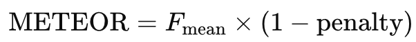

Modern medical image captioning borrows evaluation metrics from NLP and general image captioning, namely BLEU, METEOR, ROUGE, and BERTScore, but each has distinct biases that affect how well it reflects clinical correctness. BLEU emphasizes exact n-gram precision and brevity but often fails to capture synonyms or factual completeness, making it a blunt tool in radiology report generation. METEOR adds recall weighting, stemming, and synonym matching via WordNet, improving paraphrase tolerance yet still missing many medical terms. ROUGE-1/2 focus on recall of unigrams/bigrams, while ROUGE-L captures longest common subsequences, rewarding content coverage but allowing verbosity and false positives. BERTScore leverages contextual embeddings to gauge semantic similarity, offering the best alignment with clinician judgment, especially when using a domain-specific model, but at the cost of interpretability and compute. In practice, no single metric suffices: reporting a suite of metrics and, ideally, clinically grounded measures yields the most reliable assessment of chest X-ray report generators.

---

## Introduction

Automated chest X-ray report generation, transforming images into structured radiology narratives, has emerged as a key application of vision-language models. Evaluating these models poses unique challenges: unlike generic image captions, radiology reports demand precise, clinically accurate terminology and negation handling. Consequently, researchers have adapted established NLP metrics, BLEU, METEOR, ROUGE, and BERTScore, to assess model outputs against radiologist‐authored reference reports. While these metrics provide valuable quantitative signals, each has inherent strengths and limitations that influence its suitability for medical applications.

---

## BLEU-1 to BLEU-4

### Overview

BLEU (Bilingual Evaluation Understudy) measures **precision** of n-gram overlap between a candidate text and one or more references. BLEU-n (for n=1,2,3,4) computes the proportion of candidate n-grams also found in the reference, then combines them via a geometric mean and applies a brevity penalty to discourage overly short outputs ([Developer Guide - Testing with Kolena][1]).

### Technical Details

For each n-gram order n, the **modified precision** p_n is:

The overall BLEU score (for up to 4-grams) is:

with brevity penalty

where c and r are the candidate and reference lengths ([Developer Guide - Testing with Kolena][1]).

### Strengths

* **Simplicity and language-agnosticism**: straightforward n-gram matching across any language ([traceloop.com][2]).
* **Precision focus**: penalizes extraneous or incorrect generation via modified precision.

### Weaknesses in Medical Context

* **Exact matching only**: cannot recognize synonyms or paraphrases common in radiology (e.g., “pulmonary infiltrates” vs “lung opacities”) ([Developer Guide - Testing with Kolena][1]).
* **Brevity penalty bias**: may favor terse outputs that omit critical findings.
* **Poor clinical alignment**: BLEU-oracle reports often include false positives yet still score moderately well, misaligning with radiologist assessments ([ResearchGate][3]).

### Use Cases

* **General image captioning** (e.g., MS COCO) where lexical overlap is expected.
* **Baseline comparisons**, but *not* as sole metric in clinical report evaluation.

---

## METEOR

### Overview

METEOR (Metric for Evaluation of Translation with Explicit ORdering) improves upon BLEU by combining **precision** and **recall**, integrating **stemming** and **synonym matching** via resources like WordNet, and adding a penalty for fragmented matches ([Medium][4]).

### Technical Details

1. **Alignment**: Unigrams are aligned across candidate and reference using exact, stemmed, or synonym matches.
2. **Precision (P) and Recall (R)**:

   

   where m is the number of matched unigrams.
3. **F-mean** (favoring recall):

   

4. **Fragmentation penalty**: If aligned matches form c contiguous “chunks” covering m words,

   
5. **METEOR score**:

   

Parameters (e.g. 10× recall weight, 0.5 cap) derive from empirical tuning on translation data ([ACL Anthology][5]).

### Strengths

* **Synonym and stem matching**: credits varied phrasing (e.g., “cardiomegaly” vs “enlarged heart”) if in lexicon.
* **Balanced precision-recall**: ensures coverage of reference content.
* **Order penalty**: rewards coherent phrasing.

### Weaknesses in Medical Context

* **Limited lexicon**: WordNet lacks many radiology-specific terms and abbreviations.
* **Tuned for general translation**: weighting may not suit long, detailed reports.
* **No factual correctness check**: accepts incorrect term matches if synonyms align.

### Use Cases

* **General captioning or low-resource languages** where paraphrasing matters.
* **Supplement to BLEU** in medical captioning to capture wording variation, but insufficient alone.

---

## ROUGE-1, ROUGE-2, and ROUGE-L

### Overview

ROUGE (Recall-Oriented Understudy for Gisting Evaluation) emphasizes **recall** of n-gram and sequence overlap, originally for summarization ([Wikipedia][6]).

* **ROUGE-N**: fraction of reference n-grams found in the candidate.
* **ROUGE-L**: based on the **longest common subsequence** (LCS) between candidate and reference.

### Technical Details

* **ROUGE-N** (N=1,2):

 

* **ROUGE-L**: compute LCS length L let 

, then

  

  typically with beta=1.2 to favor recall ([Wikipedia][6]).

### Strengths

* **Completeness**: rewards covering all reference content, critical to avoid missing pathologies.
* **Sequence structure**: ROUGE-L captures multi-word matches (e.g., “right lower lobe consolidation”).

### Weaknesses in Medical Context

* **Recall bias**: permits verbose outputs that include spurious or incorrect findings if they overlap.
* **Exact matches only**: no synonym or paraphrase handling.
* **False positives unpenalized**: adding wrong but overlapping tokens boosts score.

### Use Cases

* **Report completeness checks**: ensure all reference findings are mentioned.
* **Summarization evaluation**, but *not* to gauge clinical correctness or conciseness.

---

## BERTScore

### Overview

BERTScore assesses **semantic similarity** via contextual embeddings. It matches tokens between candidate and reference by **cosine similarity**, producing precision, recall, and F1 based on these soft alignments ([Medium][7]).

### Technical Details

Given token embeddings c_i for the candidate and r_j for the reference (from BERT or a variant):

The **BERTScore F1** is the harmonic mean:

Optional IDF weighting and layer averaging can refine the score ([Spot Intelligence][8]).

### Strengths

* **Semantic matching**: captures paraphrases and synonyms even if wording differs.
* **Context-aware**: accounts for word sense in context (e.g., negation).
* **Better human alignment**: shown to correlate strongly with radiologist judgments when using clinical BERT variants ([ResearchGate][3]).

### Weaknesses in Medical Context

* **Computational cost**: requires heavy Transformer inference.
* **Domain mismatch**: general BERT may misinterpret specialized medical terms; domain-adapted models (BioBERT, ClinicalBERT) are preferable.
* **Interpretability**: yields a black-box similarity score without explicit error localization.

### Use Cases

* **Semantic quality assessment** of generated reports, especially when synonyms and rephrasings are expected.
* **Supplement to lexical metrics**, offering a more holistic view of text adequacy.

---

## Comparative Analysis

| Metric        | Focus                       | Handles Synonyms? | Precision vs Recall | Clinical Strengths                          | Clinical Weaknesses              |
| ------------- | --------------------------- | ----------------- | ------------------- | ------------------------------------------- | -------------------------------- |
| **BLEU**      | Lexical precision (n-grams) | No                | Precision-weighted  | Quick baseline                              | Misses paraphrases; brevity bias |
| **METEOR**    | Lexical + lexical variants  | Yes (WordNet)     | Recall-weighted     | Captures some paraphrases                   | Limited medical lexicon          |
| **ROUGE-N**   | Reference recall (n-grams)  | No                | Recall-only         | Ensures content coverage                    | Encourages verbosity             |
| **ROUGE-L**   | Reference recall (LCS)      | No                | Recall-focused      | Rewards multi-word matches                  | Same as ROUGE-N                  |
| **BERTScore** | Semantic similarity         | Yes               | Balanced            | Best human correlation (with clinical BERT) | High compute; opaque             |

---

## Recommendations for Chest X-Ray Report Evaluation

1. **Use a combination of metrics**: Pair lexical (BLEU/METEOR/ROUGE) with semantic (BERTScore) to cover surface overlap, content coverage, and meaning.
2. **Adopt clinical BERT variants** for BERTScore (e.g., PubMedBERT) to improve domain alignment.
3. **Supplement with clinical concept metrics** (e.g., CheXpert label accuracy, RadGraph overlap) to explicitly evaluate factual correctness beyond language similarity.
4. **Interpret scores in context**: High BLEU or ROUGE does not guarantee accuracy; always review common failure modes (hallucinations, missing negations).
5. **Report multiple n-gram orders** (BLEU-1 to BLEU-4) and ROUGE variants to expose different aspects of model performance.

---

## Conclusion

No single automatic metric fully captures the nuances of chest X-ray report generation. BLEU offers simplicity but overlooks paraphrasing; METEOR adds linguistic matching yet lacks medical vocabulary; ROUGE guarantees recall but can be gamed by verbosity; and BERTScore excels semantically with the right model but demands heavy compute. By reporting a suite of metrics and integrating domain-specific evaluation (e.g., clinical concept overlap), researchers can more reliably gauge model quality and clinical safety. Ultimately, human expert review remains indispensable, but these metrics provide scalable proxies to guide development and benchmarking.

---

**References**

1. “The n-gram Overlap counts… analogous to a precision score,” BLEU – Testing with Kolena ([Developer Guide - Testing with Kolena][1])
2. Banerjee & Lavie, METEOR: An Automatic Metric… (ACL 2005) ([ACL Anthology][5])
3. Lin, Chin-Yew. ROUGE: A Package for Automatic Evaluation of Summaries (WAS 2004) ([Wikipedia][6])
4. Abonia, “BERTScore Explained in 5 minutes” (Medium) ([Medium][7])
5. “Evaluating Progress in Automatic Chest X-Ray Radiology Report Generation” (ResearchGate) ([ResearchGate][3])
6. “Medical Image Captioning using CUI-based Classification” (CEUR-WS) ([CEUR-WS][9])
7. “Caption prediction performance… BLEU scores” (ResearchGate) ([ResearchGate][10])
8. Spot Intelligence, “METEOR Metric In NLP…” ([Spot Intelligence][11])
9. “Mastering ROUGE Matrix…” (DEV.to) ([DEV Community][12])
10. Galileo.ai, “BERTScore in AI…” ([Galileo AI][13])
11. Medium, “Two minutes NLP—Learn the ROUGE metric” ([Medium][14])
12. ACL Anthology, METEOR original PDF ([ACL Anthology][5])
13. ACL Anthology, ROUGE original PDF ([ACL Anthology][15])
14. TraceLoop, “Demystifying the BLEU Metric” ([traceloop.com][2])
15. Cloud Translation docs, BLEU definition ([cloud.google.com][16])

[1]: https://docs.kolena.com/metrics/bleu "BLEU - Testing with Kolena"
[2]: https://www.traceloop.com/blog/demystifying-the-bleu-metric "Demystifying the BLEU Metric: A Comprehensive Guide to Machine ..."
[3]: https://www.researchgate.net/publication/363178396_Evaluating_Progress_in_Automatic_Chest_X-Ray_Radiology_Report_Generation "Evaluating Progress in Automatic Chest X-Ray Radiology Report ..."
[4]: https://medium.com/on-being-ai/what-is-meteor-metric-for-evaluation-of-translation-with-explicit-ordering-45b49ac5ec70 "What is METEOR (Metric for Evaluation of Translation with Explicit ..."
[5]: https://aclanthology.org/W05-0909.pdf "Proceedings of the..."
[6]: https://en.wikipedia.org/wiki/ROUGE_%28metric%29 "ROUGE (metric)"
[7]: https://medium.com/%40abonia/bertscore-explained-in-5-minutes-0b98553bfb71 "BERTScore Explained in 5 minutes - Medium"
[8]: https://spotintelligence.com/2024/08/20/bertscore "BERTScore – A Powerful NLP Metric Explained & How To Tutorial"
[9]: https://ceur-ws.org/Vol-3740/paper-137.pdf"[PDF] Medical Image Captioning using CUI-based Classification and ..."
[10]: https://www.researchgate.net/figure/Caption-prediction-performance-in-terms-of-BLEU-scores_tbl3_327834342 "Caption prediction performance in terms of BLEU scores."
[11]: https://spotintelligence.com/2024/08/26/meteor-metric-in-nlp-how-it-works-how-to-tutorial-in-python "METEOR Metric In NLP: How It Works & How To Tutorial In Python"
[12]: https://dev.to/aws-builders/mastering-rouge-matrix-your-guide-to-large-language-model-evaluation-for-summarization-with-examples-jjg "Mastering ROUGE Matrix: Your Guide to Large Language Model ..."
[13]: https://www.galileo.ai/blog/bert-score-explained-guide "BERTScore in AI: Transforming Semantic Text Evaluation and Quality"
[14]: https://medium.com/nlplanet/two-minutes-nlp-learn-the-rouge-metric-by-examples-f179cc285499 "Two minutes NLP — Learn the ROUGE metric by examples - Medium"
[15]: https://aclanthology.org/W04-1013.pdf "[PDF] ROUGE: A Package for Automatic Evaluation of Summaries"
[16]: https://cloud.google.com/translate/docs/advanced/automl-evaluate "Evaluate models | Cloud Translation"
